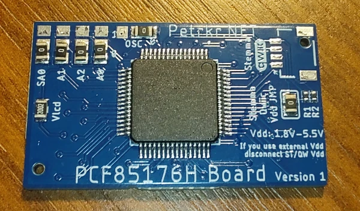
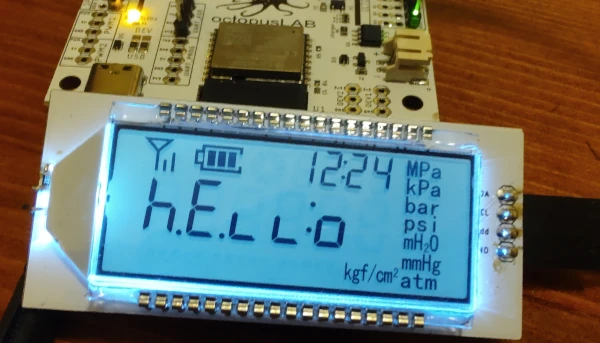
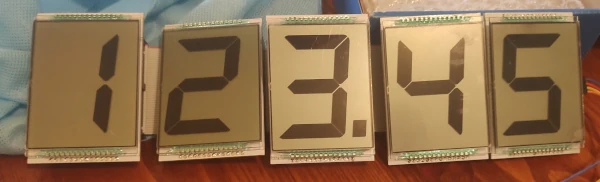
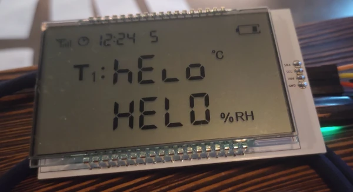
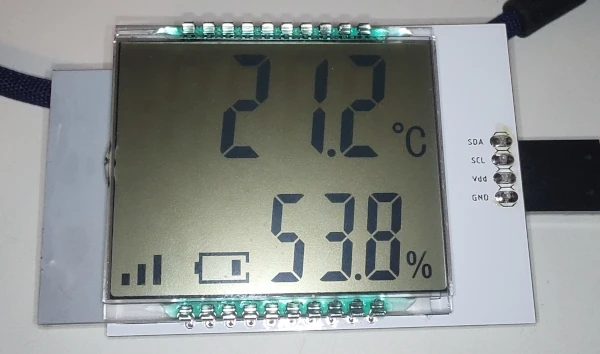
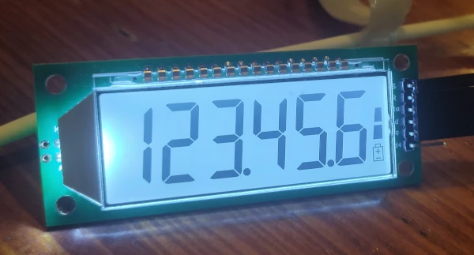
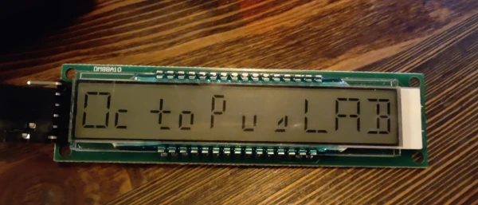
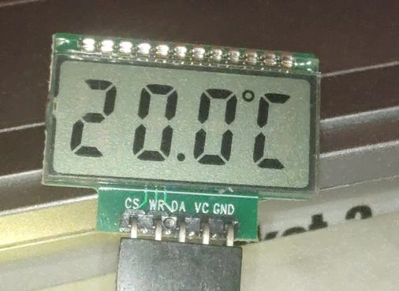
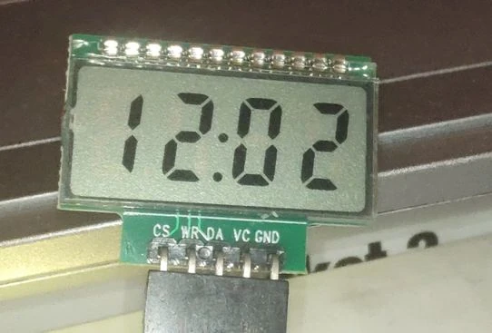
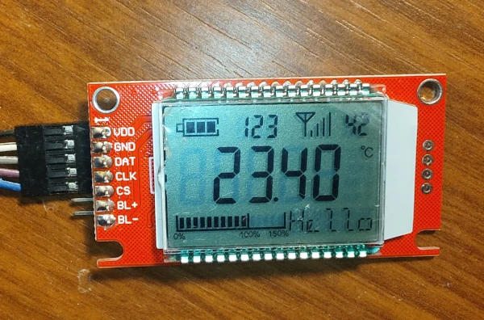

# SegLCDlib
Arduino library for segment LCD displayes and controlers.

It include abstract class, drivers and LCD display implementations.

For now LCD class is derivered from controller's class, because mostly those controllers are part of LCD already and there is no intent to use it with different.

But there could be possible to detach it and somehow redone interface, but then there must be two instances in main code. First for controller, second for LCD itself. Maybe in some next version if that will be even actual.

## Documentation

https://petrkr.github.io/SegLCDLib/

## Supported controllers

| Name     | Type           |
|----------|----------------|
| PCF85176 | I2C            |
| HT1621   | 3-wire serial  |
| HT1622   | 3-wire serial  |
| VK0192   | 3-wire serial  |

### PCF85176 Board

## Supported LCD

| Name                               | Controller(s) | Link |
|------------------------------------|---------------|------|
| RAW LCD                            | PCF85176      | N/A  |
| 6-digit signal battery progress    | PCF85176      | https://aliexpress.com/item/1005009214559485.html |
| One Digit (up to 5 segments)       | PCF85176      | https://aliexpress.com/item/1005005410565386.html |
| T1T2 Lcd                           | PCF85176      | https://aliexpress.com/item/32333296186.html      |
| Temp humidity                      | PCF85176      | https://aliexpress.com/item/1005003044283980.html |
| 6-digit with battery               | HT1621        | https://aliexpress.com/item/1005005555160141.html |
| 4-digit with degree                | HT1621        | https://aliexpress.com/item/1005009301473702.html |
| 10-digits of 16 segment            | HT1622        | https://aliexpress.com/item/1005003062619251.html |
| 5-digit signal battery progress    | VK0192        | https://aliexpress.com/item/1005009000021475.html |

### RAW LCD
This LCD type is used for testing new LCD by sending RAW data to controller. It is good to testing and implementing new types of LCD screens before starting to create actually class

### 6-digit signal, battery, progress

### One digit

### T1T2 Lcd

### Temp humidity

### 6-digit with battery
This display use integrated COB HT1621 driver.

### 10-digits of 16 segment

Based on HT1622 controller

### 4-digit with degree
 

### 5-digit signal battery progress

