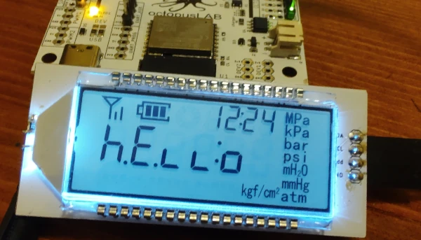
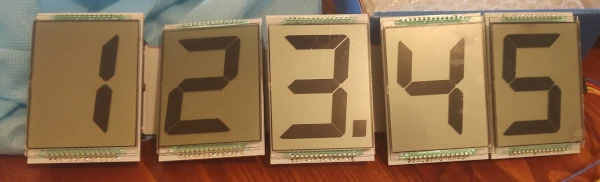
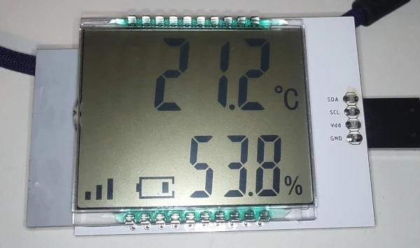
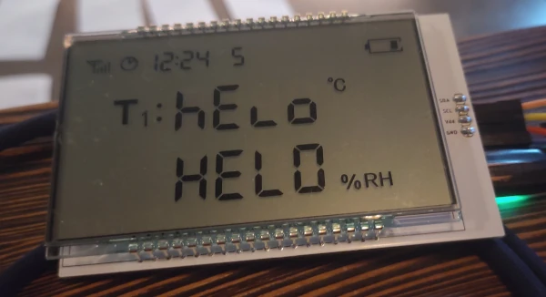
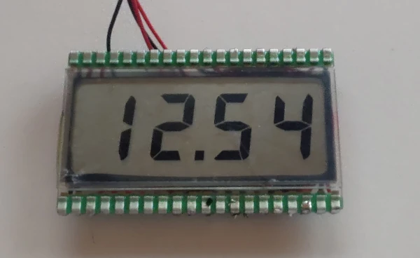
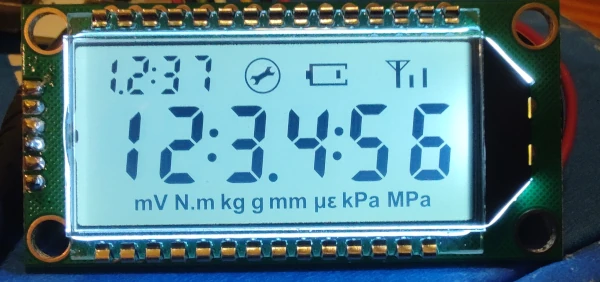
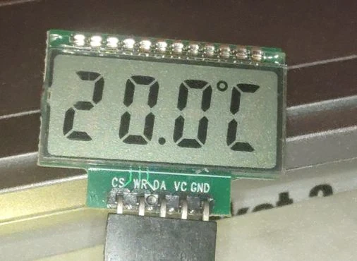
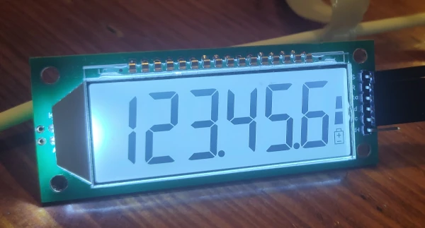
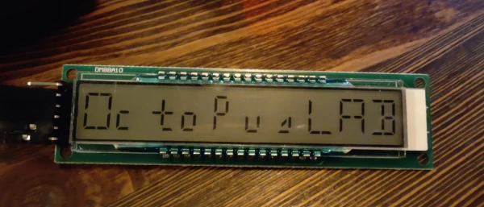
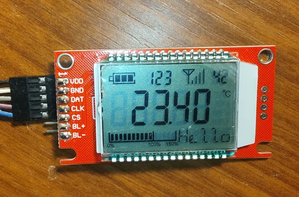

# Supported LCD Displays

All displays use segment LCD technology controlled by I2C or 3-wire serial protocol. Select by controller type and application.

---

## PCF85176 (I2C) Displays

### RAW LCD

**Purpose:** Testing and debugging new LCD implementations

- **Type:** Test harness
- **Wiring:** I2C only (2 pins: SDA, SCL)
- **Features:** Send raw segment data directly to controller
- **Use Case:** Prototype new displays before creating dedicated driver
- **Example:** `examples/PCF85176/RawLCD/`

---

### 6-Digit Signal/Battery/Progress

**Specifications:**
- **Digits:** 6 7-segment digits
- **Features:** Signal strength (4 bars), Battery level (3 states), Progress indicator
- **Wiring:** I2C (SDA, SCL)
- **I2C Address:** 0x38 (default, configurable via address pins)
- **Controller:** PCF85176
- **Image:** 
- **Example:** `examples/PCF85176/6DigSigBattProgress/`
- **Purchase:** https://aliexpress.com/item/1005009214559485.html

**Code Example:**
```cpp
#include "SegLCD_PCF85176_6DigSigBattProgress.h"
SegLCD_PCF85176_6DigSigBattProgress lcd(0x38);

lcd.init();
lcd.setCursor(0, 0);
lcd.print(123456);
lcd.setSignal(3);   // 3 of 4 bars
lcd.setBattery(2);  // Medium battery
```

---

### One Digit (Up to 5 Segments)

**Specifications:**
- **Digits:** 1 custom segment display
- **Features:** Customizable segment layout (up to 5 segments)
- **Wiring:** I2C (SDA, SCL)
- **I2C Address:** 0x38 (default)
- **Controller:** PCF85176
- **Image:** 
- **Example:** `examples/PCF85176/OneDigit/`
- **Purchase:** https://aliexpress.com/item/1005005410565386.html

---

### Temperature/Humidity

**Specifications:**
- **Digits:** 6 7-segment digits
- **Features:** Temperature and humidity symbols
- **Wiring:** I2C (SDA, SCL)
- **I2C Address:** 0x38 (default)
- **Controller:** PCF85176
- **Image:** 
- **Example:** `examples/PCF85176/TempHumidity/`
- **Purchase:** https://aliexpress.com/item/1005003044283980.html

**Code Example:**
```cpp
#include "SegLCD_PCF85176_TempHum.h"
SegLCD_PCF85176_TempHum lcd(0x38);

lcd.init();
lcd.setCursor(0, 0);  // Temperature row
lcd.print(23);        // 23°C
lcd.setCursor(1, 0);  // Humidity row
lcd.print(45);        // 45%
```

---

### T1T2 LCD

**Specifications:**
- **Layout:** 3-row display (Clock, T1 Label, T2 Label)
- **Features:** Multi-zone control for temperature sensors
- **Wiring:** I2C (SDA, SCL)
- **I2C Address:** 0x38 (default)
- **Controller:** PCF85176
- **Image:** 
- **Example:** `examples/PCF85176/T1T2Lcd/`

---

### 4DR821B / 4DT821B (Tesla)

**Specifications:**
- **Segments:** Custom Tesla dashboard display
- **Features:** Multiple symbol zones
- **Wiring:** I2C (SDA, SCL)
- **I2C Address:** 0x38 (default)
- **Controller:** PCF85176
- **Image:** 
- **Reference:** https://www.teslakatalog.cz/4DR821B.html
- **Example:** `examples/PCF85176/4DR821B/`

---

### 4+6 Digit Maint/Bat/Sig/Units

**Specifications:**
- **Digits:** 4 digits (main) + 6 digits (status)
- **Features:** Maintenance, Battery, Signal, Unit symbols
- **Wiring:** I2C (SDA, SCL)
- **Controller:** PCF8576 (enhanced variant)
- **Image:** 
- **Example:** `examples/PCF8576/4Seg6SegMaintSegBatUnits/`
- **Purchase:** https://aliexpress.com/item/1005009599538480.html

---

## HT1621 (3-Wire Serial) Displays

### 4-Digit with Degree Symbols

**Specifications:**
- **Digits:** 4 7-segment digits
- **Features:** Degree symbol, Colon for time display
- **Wiring:** 3 pins (CLK, DATA, CS) + Power + GND
- **Protocol:** 3-wire serial
- **Controller:** HT1621 (integrated in module)
- **Image:** 
- **Example:** `examples/HT1621/4DigDeg/`
- **Purchase:** https://aliexpress.com/item/1005009301473702.html

**Code Example:**
```cpp
#include "SegLCD_HT1621_4SegDegree.h"

// Pin configuration
const int CLK = 5, DATA = 6, CS = 7;
SegLCD_HT1621_4SegDegree lcd(CLK, DATA, CS);

lcd.init();
lcd.setCursor(0, 0);
lcd.print(25);      // Display "25°"
```

**Wiring Example (Arduino Uno):**
```
HT1621 Module  →  Arduino
CLK            →  Pin 5
DATA           →  Pin 6
CS (chip sel)  →  Pin 7
VCC            →  3.3V or 5V
GND            →  GND
```

---

### 6-Digit with Battery

**Specifications:**
- **Digits:** 6 7-segment digits
- **Features:** Battery level indicator (3-4 states)
- **Wiring:** 3 pins (CLK, DATA, CS) + Power + GND
- **Protocol:** 3-wire serial
- **Controller:** HT1621 (integrated)
- **Image:** 
- **Example:** `examples/HT1621/6DigBat/`
- **Purchase:** https://aliexpress.com/item/1005005555160141.html

**Code Example:**
```cpp
#include "SegLCD_HT1621_6SegBat.h"

const int CLK = 5, DATA = 6, CS = 7;
SegLCD_HT1621_6SegBat lcd(CLK, DATA, CS);

lcd.init();
lcd.print(123456);
lcd.setBattery(2);  // Medium battery
```

---

### RAW LCD (HT1621)

**Purpose:** Testing and prototyping with HT1621

- **Type:** Test harness
- **Wiring:** 3-wire serial (CLK, DATA, CS)
- **Features:** Send raw segment data to HT1621
- **Example:** `examples/HT1621/RawLCD/`

---

## HT1622 (3-Wire Serial, Enhanced)

### 10-Digit 16-Segment Display

**Specifications:**
- **Digits:** 10 digits with 16-segment layout
- **Features:** Enhanced segment capability (alphanumeric capable)
- **Wiring:** 3 pins (CLK, DATA, CS) + Power + GND
- **Protocol:** 3-wire serial (4μs timing)
- **Controller:** HT1622 (integrated, larger RAM)
- **Image:** 
- **Example:** `examples/HT1622/10Digit16SegmentLCD/`
- **Purchase:** https://aliexpress.com/item/1005003062619251.html

---

### RAW LCD (HT1622)

**Purpose:** Testing and prototyping with HT1622

- **Type:** Test harness
- **Wiring:** 3-wire serial (CLK, DATA, CS)
- **Features:** Send raw segment data to HT1622
- **Timing:** Requires 4μs pulse width
- **Example:** `examples/HT1622/RawLCD/`

---

## VK0192 (3-Wire Serial)

### 5-Digit Signal/Battery/Progress

**Specifications:**
- **Digits:** 5 7-segment digits
- **Features:** Signal bars (4), Battery level (3), Progress indicator
- **Wiring:** 3 pins (CLK, DATA, CS) + Power + GND
- **Protocol:** 3-wire serial (4μs timing)
- **Controller:** VK0192 (24×8 bit RAM, irregular addressing)
- **Image:** 
- **Example:** `examples/VK0192/5DigSigBattProgress/`
- **Purchase:** https://aliexpress.com/item/1005009000021475.html

**Code Example:**
```cpp
#include "SegLCD_VK0192_5SegSigBatProg.h"

const int CLK = 5, DATA = 6, CS = 7;
SegLCD_VK0192_5SegSigBatProg lcd(CLK, DATA, CS);

lcd.init();
lcd.print(12345);
lcd.setSignal(3);    // 3 of 4 bars
lcd.setBattery(1);   // Low battery
```

---

## Quick Comparison

| Controller | Protocol | Pins | I2C Addr | Examples | Complexity |
|-----------|----------|------|----------|----------|------------|
| **PCF85176** | I2C | 2 | 0x38 | 6 | Simple |
| **PCF8576** | I2C | 2 | 0x38 | 1 | Simple |
| **HT1621** | 3-wire | 3 | N/A | 3 | Medium |
| **HT1622** | 3-wire | 3 | N/A | 2 | Medium |
| **VK0192** | 3-wire | 3 | N/A | 1 | Advanced |

## Adding a New Display

Don't see your LCD? Follow the [Adding New LCD](adding-new-lcd.md) guide to create support for any segment display.

## Resources

- **Getting Started:** [Getting Started Guide](getting-started.md)
- **Architecture:** [Library Architecture](architecture.md)
- **Controller Details:** [Controllers](controllers.md)
- **Creating Drivers:** [Adding New LCD](adding-new-lcd.md)
- **API Reference:** [Full API Documentation](https://petrkr.github.io/SegLCDLib/)
